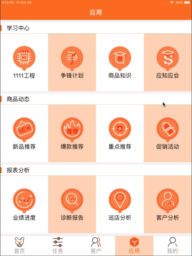

# react-native-navigation-cus
react-native的导航组件，基于[react-navigation@1.5.11](https://github.com/react-navigation/react-navigation)，修改而成；<BR\>
更好的页面导航封装，并且增加进入页面的方法回调（componentWillEnter）和退出页面的方法回调（componentWillExit） <Br/>
<b>
完美的页面导航跳转返回；<BR/>
每一个Tab页面组都有自己的返回逻辑，互不影响；<BR/>
杜绝了传统的记住历史页面进行的返回，返回到别的Tab页面组；<BR/>
</b>


由于react-navigation在TabNavigator和DrawerNavigator下，页面打开过，就不更新了，也没有回调方法刷新页面，也无法准确返回页面，故再次修改封装此组件

### 安装组件：
npm i --save react-native-navigation-cus

### 使用 （此导航组件可查看[react-navigation](https://github.com/react-navigation/react-navigation)，或百度搜索react-navigation的使用与配置）
##### 组件BaseComponent 方法参数请查看源文件里面有详细的注释，继承导航属性;这个组件中的方法都是"静态和动态"两种调用方式
```javascript
this.goPage();//跳转页面
BaseComponent.goPage();//跳转页面
this.goBack();//返回已进入的页面
BaseComponent.goBack();//返回已进入的页面
this.setParams();//设置参数改变导航栏
BaseComponent.setParams();//设置参数改变导航栏
this.getPageParams();//获取页面跳转传递的参数
BaseComponent.getPageParams();//获取页面跳转传递的参数

 /**
     * 导航栏按钮设置
     * headerLeft：//导航栏左边按钮可传 bool（false:隐藏左边默认UI;true:显示左边默认UI）、图片(url)、UI
     * headerRight：//导航栏右边按钮可传 bool（false:隐藏左边默认UI;true:显示左边默认UI）、图片(url)、UI
     * headerLeftHandle://函数方法 可在左边按钮点击返回之前执行
     * headerRightHandle://函数方法 右边按钮点击执行
     * **/ 
 //还有很多react-navigation支持的参数都可通过此方法传递
this.setParams({
  headerLeft:true,//导航栏左边按钮可传 bool（false:隐藏左边默认UI;true:显示左边默认UI）、图片(url)、UI
  headerRight:true,//导航栏右边按钮可传 bool（false:隐藏左边默认UI;true:显示左边默认UI）、图片(url)、UI
  headerLeftHandle:function(){},//函数方法 可在左边按钮点击返回之前执行
  headerRightHandle:function() {}//函数方法 右边按钮点击执行
});//设置参数改变导航栏

//继承BaseComponent,将有两个生命周期回调方法
/**
* 进入页面时回调此方法
* @param params json,//第一个参数，页面传递参数
* @param action object,第二个参数，页面传递动作
* @param routeName string,第三个参数，页面名
* **/
componentWillEnter(params,action,routeName);//进入页面时回调此方法
componentWillExit();//退出页面时回调此方法
```

### 示例
```javascript
import React, {Component} from 'react';
import StyleSheetAdapt from "react-native-stylesheet-adapt";
import {
    BaseComponent,
    StackNavigator,
    TabNavigator,
    CardStackStyleInterpolator
} from "react-native-navigation-cus";
import {
   Text,
   View,
   Text,
   TouchableOpacity,
} from 'react-native';

type Props = {};
export default class PageLogin extends BaseComponent<Props> {

    constructor(props) {
        super(props);
           let param = Tools.userConfig.userCutAccount
           && Tools.userConfig.userCutAccount.length > 0
            ? {
                headerLeft:<ImageChange icon={require("images/role.png")}
                                        onPressIn={()=>PageSearchRole.show(this)}
                                        style={styles.hLeft}/>
            }
            : {
                headerLeft:false
            };

        this.setParams(param);
    }
    
    /**
    * 进入页面时回调此方法
    * @param params json,//第一个参数，页面传递参数
    * @param action object,第二个参数，页面传递动作
    * @param routeName string,第三个参数，页面名
    * **/
    componentWillEnter(params,action,routeName){
        
    }//进入页面时回调此方法
    componentWillExit(){
        
    }//退出页面时回调此方法
    
    render() {
        return (
            <View>
                <BarcodeView ref={c=>this.barcodeView = c}
                    style={styles.testStyle}/>
                <Text onPress={()=>this.barcodeView.startScan()}>
                    开始扫码
                </Text>
                <TouchableOpacity onPress={()=>this.goPage('PageMain')}>
                     <Text>
                          下一页
                     </Text>
                </TouchableOpacity>
            </View>
        );
    }
}

const styles = StyleSheetAdapt.create({

    testStyle2:{
        width:100,
        height:200,
    },
    testStyle:{
        transform:[
            {rotateX:'180deg'}
        ],
    },
});

const StackPages = {
    PageLogin: {
        screen: PageLogin,
        navigationOptions:({navigation}) =>({
            header:null,
        })
    },
    PageMain: { screen: PageMain },
};

const App = StackNavigator(StackPages,{
    // initialRouteName: 'PageTripDetail',
    // headerMode:'none',
    // backBehavior: 'none', // 按 back 键是否跳转到第一个Tab(首页)， none 为不跳转
    navigationOptions:{
        /*headerLeft:<Image source={require('./../res/images/leftWhite.png')}
                          style={styles.iconLeft}/>,*/
        //header: null,//无导航条
        //headerLeft:null,
        gesturesEnabled:false,
        headerStyle:{
            backgroundColor: '#FF6B01',
            //color:"#FFFFFF",
            height:StyleSheetAdapt.getHeight(60),
        },
        headerTitleStyle:{
            flex: 1,
            textAlign: 'center',
            fontSize:StyleSheetAdapt.getWidth(25),
        },
        //headerTitle:'首页',
        headerBackTitleStyle:{
            //color:"#FFFFFF",
            /*width:40,
            height:40,*/
        },
        headerTintColor:'#FFFFFF',
        headerBackTitle:null,
        // headerTitleStyle:{
        //     fontSize: StyleSheetAdapt.getWidth(25),
        // },
    },
    mode:'none',
    //headerMode:"float",
    transitionConfig:()=>({
        screenInterpolator:CardStackStyleInterpolator.forHorizontal,
    }),
});

module.exports = App;

```

### [我的博客](http://blog.sina.com.cn/s/articlelist_6078695441_0_1.html)


